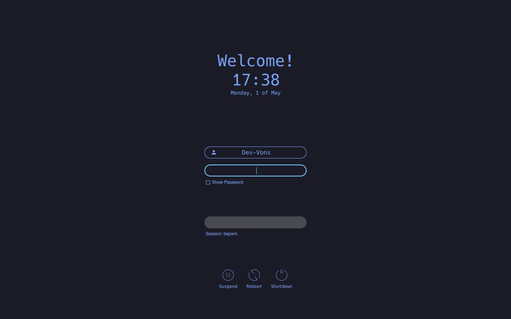

# My custom sddm theme 
Kinda good. I tested it on my local machine (it should work for any machine running Linux)

This is my custom sddm theme. The installation is basically the same. But instead just clone my repo, not main repo (to get my theme respectively).

# Preview

    

